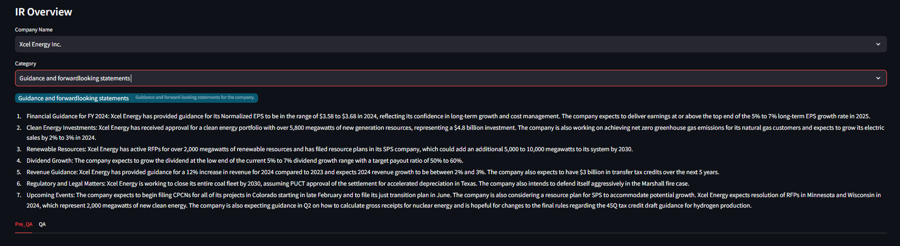
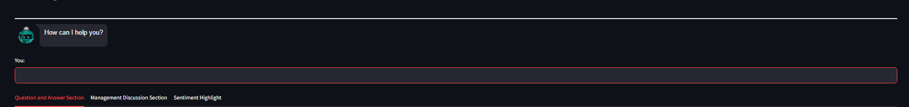
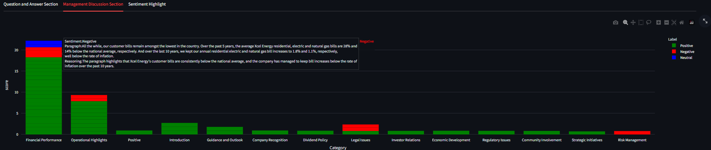

# LLM_Earnings_Call

## Name
Earnings Call Dashboard (Mixtral)

## Data
Publically available earnings call transcript data.

## LLM Model Used

Databricks Pay-per-token Mixtral API : https://docs.databricks.com/en/machine-learning/foundation-models/index.html

## Description
Generate Informative dashboards based on the most recent transcript of an earnings call in the calendar quarter and are typically made public 3 hours after the call. 
The Dashboard consists of 5 sections :
1. Report Overview Section(Report Generation using llm context refinement) -  A brief overview of the company's financial performance during the quarter, highlighting key metrics such as revenue, net income, earnings per share, and capital allocation.
2. Chatbot - Chatbot to ask questions about the company's earnings call.
3. Question and Answer Section(Topic Modeling and Q&A Extraction using LLM) -  Question and Answer's asked in the call along with important highlights segmented by topic.  
4. Management Discussion Section(Sentiement Analysis and Reasoning using LLM) - Sentiement Analysis with reasoning, based on the management discussion section of the call.   
5. Transcript Highlight - Sentiment based highlighting on the earnings call transcript pdf files.   

## Visuals
* Report Overview Section (**LLM GENERATED CONTEXT REFINEMENT**)

* Chatbot (**RAG CHATBOT**)

 

* Question and Answer Section (**LLM GENERATED TOPIC MODELING AND Q&A EXTRACTION**)

 

* Management Discussion Section (**LLM GENERATED SENTIMENT ANALYSIS**)

* Transcript Highlight

## Project Plan

1. Report Overview (**LLM GENERATED CONTEXT REFINEMENT**)

  * Split PDF into chunks.

  * Create prompt to output report in a JSON format based on following categories : (Summary, Revenue growth drivers and challenges, Margin performance and expense management, Earnings quality and non-GAAP metrics, Capital allocation and cash flow, Guidance and forward-looking statements, Conclusion)

  

  

  * Loop through the JSON outputs and combine responses across all the individual categories (example shown only for the first two chunks of the summary category)
  
  

  * Create a summary Prompt to summarize the combined response across each category.

  
  
  * Save as csv.

2. Chatbot (**RAG CHATBOT**)
  * Format PDF to remove disclaimers.
  * Remove Q&A section due to information overlap.
  * Pass entire PDF as context leveraging mixtral's large token length.

3. Question and Answer Section (**LLM GENERATED TOPIC MODELING AND Q&A EXTRACTION**)

  * Extract Question and Answer section from the PDF.

  * Generate LLM Prompt (JSON Response) to extract question & answer pairs and assign categories along with importance scores based on the question asked.
  
  

  * Loop through the JSON response and filter out q&a pairs with low scores.   

  

  * Save as csv.

  

4. Management Discussion Section (**LLM GENERATED SENTIMENT ANALYSIS**)

  * Extract Management Discussion section from PDF.  

  * Calcualted Sentiment Score using sentiment analysis models : finbert, distilbert and roberta 

  

  * Ensemble Sentiment Score to get accurate sentiment values.

  

  * Generate LLM prompt (JSON Response) to use existing sentiment and paragraph to come up with a Category and Reasoning behind the sentiment. 

  

  * Save as csv.

  

5. Transcript Highlight

 * Creating bounding boxes in PDF and extract text using Fitz library.
 * Split text into sentences.
 * Caluclate sentence wise sentiment and highlight text in PDF based on sentence sentiment.    
 * Save as csv.

## Installation
1. Clone repo. (git clone https://gitlab.com/xcel-master/data_science/llm_earnings_call.git)

2. Set variables in config.yml and commit the changes to git.

   

3. Pip Install requirements.txt (pip install -r requirements.txt)

4. Run report_gen_job.py (python report_gen_job.py)

   Check Job Run on UI and wait for Status : Succeeded

   

5. Run app.py using streamlit to load frontend (streamlit run app.py).

   

## Authors and acknowledgment

Hari Purnapatre : hari.k.purnapatre@xcelenergy.com

Blake Kleinhans: blake.e.kleinhans@xcelenergy.com

